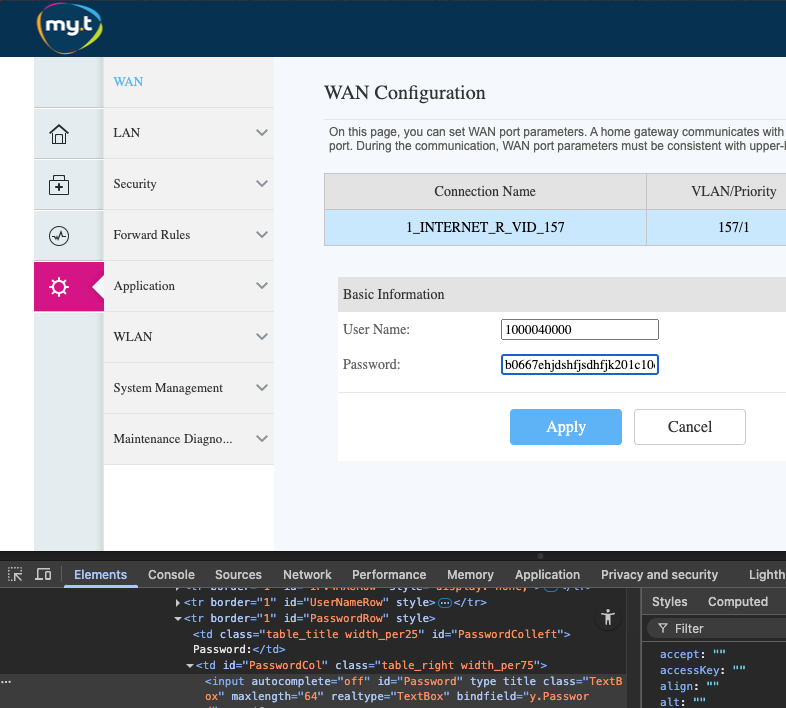

# Myt IP Renewer

A Python script that automatically renews your Mauritius Telecom (MYT) IP address by either rebooting the Huawei HG8145 router or reconnecting the WAN connection, helping prevent daily disconnections.

## Prerequisites

- Python 3.x
- pip (Python package installer)
- Huawei HG8145 router (MYT provided)
- Mauritius Telecom (MYT) internet connection


## Installation

1. Clone the repository or download the script
2. Install required packages using requirements.txt:
```bash
pip install -r requirements.txt
```

## Configuration

A `.env.sample` file is provided as a template for your configuration. To set up:

1. Copy `.env.sample` to create your own `.env` file:
```bash
cp .env.sample .env
```

2. Edit the `.env` file with your specific credentials:
```env
# Router authentication (default credentials for MYT Huawei HG8145)
ROUTER_USERNAME=root
ROUTER_PASSWORD=YWRtaW4%3D  # Base64 encoded "admin"
ROUTER_IP=192.168.100.1

# MYT WAN connection credentials
WAN_USERNAME=your_wan_username
WAN_PASSWORD=your_wan_password
```

## Usage

The script supports two main operations to help maintain a stable MYT internet connection:

### Reboot Router

Use this option to completely restart the Huawei HG8145 router, which will force a new IP address assignment from MYT (~2 minutes downtime).

```bash
python myt.py --reboot
```

### Reconnect WAN

Use this option to only reconnect the WAN connection without a full router reboot, which is useful for quick IP renewal (~15 seconds downtime).

```bash
python myt.py --reconnect
```

You can get WAN connection credentials in the router's web admin panel (http://192.168.100.1) under WAN settings - make sure to save them safely as the script will temporarily use incorrect credentials to force reconnection.


